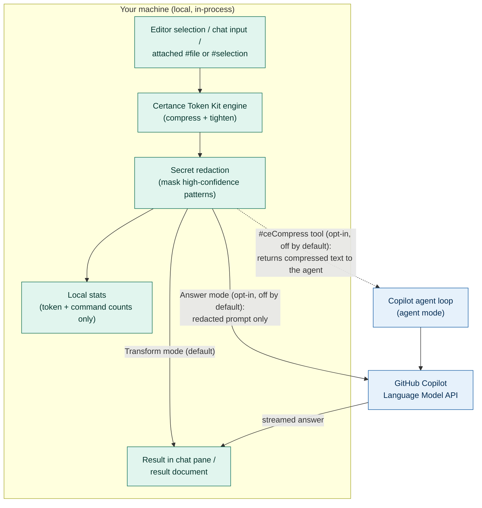

# Certance Token Kit - Data-Flow Diagram

Where data goes for each capability. The dashed boundary is **your machine** -
nothing crosses it except in the opt-in Answer mode / agent paths, and only
after secret redaction.

## Reading the diagram

| Path | Trigger | Crosses the boundary? |
|---|---|---|
| `SRC -> ENG -> RED -> OUT` | Default. Transform mode, all slash commands, palette commands. | **No.** Fully local. |
| `RED -> STATS` | Every run. | **No.** Local counts only - never content. |
| `RED -> MODEL -> OUT` | **Answer mode** (`ceTokenKit.chat.answerMode`, off by default). | **Yes** - the *redacted* prompt only, over Copilot's LM API (the same path as Copilot Chat). |
| `RED -> AGENT -> MODEL` | **`#ceCompress`** (`ceTokenKit.agentTool.enabled`, off by default). | The tool itself does no network I/O; it shrinks what the already-running agent sends to the model. |

## Key properties
- The engine and redaction run **before** anything is displayed or sent - so even on the Answer-mode path, the model receives the redacted prompt.
- The extension makes **no network calls of its own**; the only egress is via Copilot's own LM API on the two opt-in paths above.
- With `answerMode` and `agentTool.enabled` both `false`, only the all-local path is reachable.

## Enforcement boundaries (what's guaranteed vs. advisory)

A security reviewer's most important question is *which controls a platform enforces* versus *which rely on repository policy or agent behaviour*. The kit is explicit about this - nothing below is oversold.

| Control | Type | Coverage / caveat |
|---|---|---|
| **GitHub content exclusion** | Platform-enforced | Chat, completions, and code review. **Not** VS Code Edit mode, Agent mode, or Copilot CLI - a [documented GitHub limitation](https://docs.github.com/en/copilot/concepts/context/content-exclusion). |
| **`AGENTS.md` agent policy** | Behavioural / advisory | Layer 3 - closes the Edit/Agent/CLI gap by instructing the agent. Depends on the agent honouring it; not platform-enforced. |
| **Secret redaction** (this kit) | Locally enforced | Masks high-confidence patterns before anything is displayed or sent. Best-effort regex, no AI - defence in depth, not a guarantee. |
| **Pre-commit secret scan** (`CE: Install Pre-commit Secret Scan`) | Locally enforced *when installed* | Blocks a commit carrying a staged secret. Honest bypass: `git commit --no-verify`. |
| **Model routing advice** (`CE: Recommend a Model...`) | Advisory | Recommends a cost tier; the extension **cannot** switch your Copilot model. |
| **MCP tool posture** | Advisory / reported | Summarised in the audit pack; the kit never modifies MCP connections. |

`CE: Export Audit Evidence` renders this same matrix plus a per-workspace **posture checklist** (content-exclusion config present, `AGENTS.md` present, MCP checked, redactions this period) - without storing secret values or excluded file content.
